# GitHub Resonance Imaging (GRI)

[](https://github.com/rock/github-resonance-imaging/actions)
[](LICENSE)

> An animated MRI scan visualization of GitHub contribution graphs.

Pull a GitHub user's contribution graph, simulate an MRI acquisition sequence — complete with k-space filling, echo formation, and image reconstruction — then render it as an animated SVG or interactive HTML.

<picture>
  <source media="(prefers-color-scheme: dark)" srcset="https://raw.githubusercontent.com/rock/github-resonance-imaging/output/gri-dark.svg" />
  <source media="(prefers-color-scheme: light)" srcset="https://raw.githubusercontent.com/rock/github-resonance-imaging/output/gri-light.svg" />
  
</picture>

## Features

- **MRI Simulation** — Watch the scan line sweep across weeks, fill k-space, form an echo, and reconstruct the contribution image
- **Dark & Light Themes** — Automatic theme switching via `prefers-color-scheme`
- **Interactive Controls** — Pause/play and re-scan
- **GitHub Action** — Auto-generate daily for your profile README
- **Interactive Demo** — Try it live at [rock.github.io/github-resonance-imaging](https://rock.github.io/github-resonance-imaging)

## Usage

### GitHub Action

Add to your profile README workflow:

```yaml
- uses: rock/github-resonance-imaging@v1
  with:
    github_user_name: ${{ github.repository_owner }}
    outputs: |
      dist/gri-dark.svg?theme=dark
      dist/gri-light.svg?theme=light
```

Then embed in your README:

```html
<picture>
  <source media="(prefers-color-scheme: dark)" srcset="gri-dark.svg" />
  <source media="(prefers-color-scheme: light)" srcset="gri-light.svg" />
  
</picture>
```

### Interactive Demo

Visit the live demo: **[rock.github.io/github-resonance-imaging](https://rock.github.io/github-resonance-imaging)**

Or run locally:

```bash
npm install
npm run dev
```

### Parameters

The scanner displays realistic MRI parameters:

| Parameter | Value | Description |
|-----------|-------|-------------|
| Seq | GitEcho | Pulse sequence name |
| TR | 7 d | Repetition Time (per week) |
| TE | 24 h | Echo Time (per day) |
| FA | 42° | Flip Angle |
| Matrix | 52×7 | 52 weeks × 7 days |
| FOV | 365 d | Field of View (one year) |
| NEX | 1 | Number of Excitations |

## Implementation

The visualization is built with pure HTML5 Canvas and vanilla JavaScript:

- **Main Canvas** — Contribution grid with scanning line animation
- **k-space Canvas** — Real-time k-space filling visualization
- **Echo Canvas** — MR signal echo waveform
- **HUD Panel** — Live acquisition parameters

### Project Structure

```
github-resonance-imaging/
├── packages/
│   └── action/          # GitHub Action entry point
├── .github/
│   └── workflows/       # CI/CD workflows
├── github_resonance_imaging_scanner.html        # Dark theme
├── github_resonance_imaging_scanner_light.html  # Light theme
├── index.html           # Interactive demo page
├── package.json
├── action.yml           # GitHub Action metadata
└── README.md
```

## Development

```bash
# Install dependencies
npm install

# Run local dev server
npm run dev

# Format code
npm run format

# Lint code
npm run lint
```

## License

MIT © [rock](https://github.com/rock)
